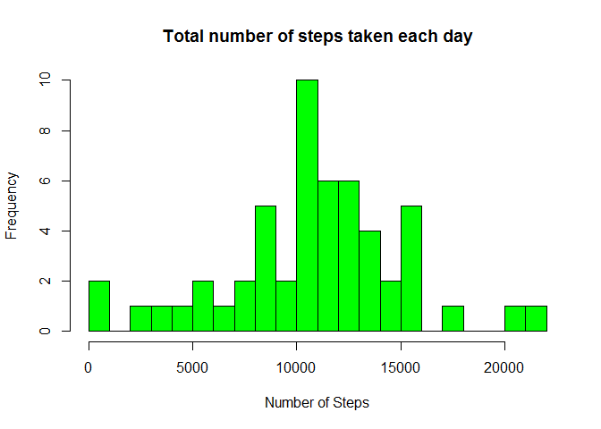
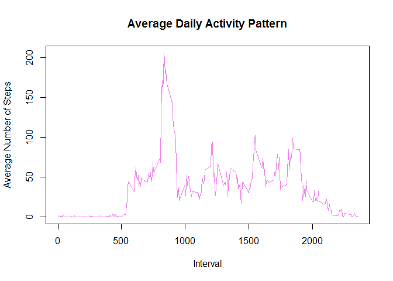
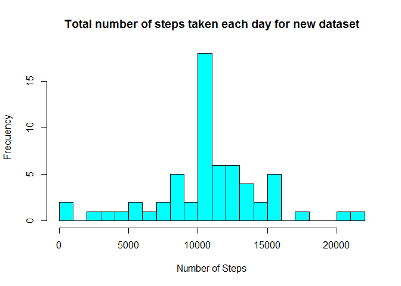

## Introduction

This assignment makes use of data from a personal activity monitoring device, which collects data at 5 minute intervals throughout the day. The data consists of two months of data from an anonymous individual collected during the months of October and November, 2012 and include the number of steps taken in 5 minute intervals each day.

The data for this assignment was downloaded from the course web site:
  
[Activity monitoring data](https://d396qusza40orc.cloudfront.net/repdata%2Fdata%2Factivity.zip) 

The variables included in this dataset are:
  
  1. **Steps:** Number of steps taking in a 5-minute interval (missing values are coded as 𝙽)
  
  2. **Date:** The date on which the measurement was taken in YYYY-MM-DD format
  
  3. **Interval:** Identifier for the 5-minute interval in which measurement was taken

The dataset is stored in a comma-separated-value (CSV) file and it consists of 17,568 observations. 
  
  
## Loading and preprocessing the data


```r
library(data.table)
library(ggplot2)
activity_data <- read.csv("activity.csv")
summary(activity_data)
```

```
##      steps            date              interval     
##  Min.   :  0.00   Length:17568       Min.   :   0.0  
##  1st Qu.:  0.00   Class :character   1st Qu.: 588.8  
##  Median :  0.00   Mode  :character   Median :1177.5  
##  Mean   : 37.38                      Mean   :1177.5  
##  3rd Qu.: 12.00                      3rd Qu.:1766.2  
##  Max.   :806.00                      Max.   :2355.0  
##  NA's   :2304
```

```r
str(activity_data)
```

```
## 'data.frame':	17568 obs. of  3 variables:
##  $ steps   : int  NA NA NA NA NA NA NA NA NA NA ...
##  $ date    : chr  "2012-10-01" "2012-10-01" "2012-10-01" "2012-10-01" ...
##  $ interval: int  0 5 10 15 20 25 30 35 40 45 ...
```

```r
head(activity_data)
```

```
##   steps       date interval
## 1    NA 2012-10-01        0
## 2    NA 2012-10-01        5
## 3    NA 2012-10-01       10
## 4    NA 2012-10-01       15
## 5    NA 2012-10-01       20
## 6    NA 2012-10-01       25
```


## What is mean total number of steps taken per day?

1. Calculate the total number of steps taken per day


```r
# Subsetting data to ignore missing values
no_missingvalues<- is.na(as.character(activity_data$steps))
data_new <- activity_data[!no_missingvalues,]
head(data_new)
```

```
##     steps       date interval
## 289     0 2012-10-02        0
## 290     0 2012-10-02        5
## 291     0 2012-10-02       10
## 292     0 2012-10-02       15
## 293     0 2012-10-02       20
## 294     0 2012-10-02       25
```

```r
# Calculating total number of steps per day
Total_steps <- aggregate(steps ~ date, data = data_new, sum)
colnames(Total_steps) <- c("date", "steps")
```

2. Make a histogram of the total number of steps taken each day. 


```r
hist(as.numeric(Total_steps$steps), breaks = 20, col = "green", xlab = "Number of Steps", main= "Total number of steps taken each day")
```

<!-- -->

3. Calculate and report the mean and median of the total number of steps taken per day

```r
# Calculating mean
mean(Total_steps$steps)
```

```
## [1] 10766.19
```

```r
# Calculating median
median(Total_steps$steps)
```

```
## [1] 10765
```


## What is the average daily activity pattern?

1. Make a time series plot (i.e. 𝚝𝚢𝚙𝚎 = "𝚕") of the 5-minute interval (x-axis) and the average number of steps taken, averaged across all days (y-axis)


```r
steps_interval<- aggregate(data_new$steps,by=list(interval=data_new$interval), FUN=mean)
colnames(steps_interval) <- c("interval", "average_steps")
plot(steps_interval$interval,steps_interval$average_steps, type="l", xlab = "Interval", ylab = "Average Number of Steps", main = "Average Daily Activity Pattern",  col ="violet")
```

<!-- -->

2. Which 5-minute interval, on average across all the days in the dataset, contains the maximum number of steps?
  

```r
max_steps <- max(steps_interval$average_steps)
max_steps
```

```
## [1] 206.1698
```

```r
interval<-steps_interval[which.max(steps_interval$average_steps),]$interval
interval
```

```
## [1] 835
```


## Imputing missing values

1. Calculate and report the total number of missing values in the dataset (i.e. the total number of rows with 𝙽𝙰s)


```r
sum(is.na(activity_data))
```

```
## [1] 2304
```

2. The strategy for filling in all of the missing values in the dataset. Missing values are replaced by the mean of that 5-minute interval


```r
# finding the missing values (NAs)
missing_values <- which(is.na(as.character(activity_data$steps)))
activity_data1 <- activity_data

# replacing missing values using the mean for that 5-minute interval
activity_data1[missing_values, ]$steps<-unlist(lapply(missing_values, FUN=function(missing_values){
  steps_interval[activity_data[missing_values ,]$interval==steps_interval$interval,]$average_steps
}))
```

3. Creating a new dataset that is equal to the original dataset but with the missing data filled in


```r
summary(activity_data1)
```

```
##      steps            date              interval     
##  Min.   :  0.00   Length:17568       Min.   :   0.0  
##  1st Qu.:  0.00   Class :character   1st Qu.: 588.8  
##  Median :  0.00   Mode  :character   Median :1177.5  
##  Mean   : 37.38                      Mean   :1177.5  
##  3rd Qu.: 27.00                      3rd Qu.:1766.2  
##  Max.   :806.00                      Max.   :2355.0
```

```r
str(activity_data1)
```

```
## 'data.frame':	17568 obs. of  3 variables:
##  $ steps   : num  1.717 0.3396 0.1321 0.1509 0.0755 ...
##  $ date    : chr  "2012-10-01" "2012-10-01" "2012-10-01" "2012-10-01" ...
##  $ interval: int  0 5 10 15 20 25 30 35 40 45 ...
```

4. Making a histogram of the total number of steps taken each day for the complete dataset and calculate and report the mean and median total number of steps taken per day. Do these values differ from the estimates from the first part of the assignment? What is the impact of imputing missing data on the estimates of the total daily number of steps?


```r
steps_activity_data1 <- aggregate(steps ~ date, data = activity_data1, sum)
colnames(steps_activity_data1) <- c("date", "steps")

# making the histogram
hist(as.numeric(steps_activity_data1$steps), breaks = 20, col = "cyan", xlab = "Number of Steps", main= "Total number of steps taken each day for new dataset")
```

<!-- -->

```r
# calculating mean and median of the new dataset
mean(steps_activity_data1$steps)
```

```
## [1] 10766.19
```

```r
median(steps_activity_data1$steps)
```

```
## [1] 10766.19
```

*The mean of the new dataset (10766) is equal to the mean of the dataset without missing values. However, the median of the new dataset has shifted from 10765 to 10766. Therefore, the mean and median for the new dataset are almost identical. we can conclude that imputing the missing data does not have much effect on the estimates of the total daily number of steps.*

## Are there differences in activity patterns between weekdays and weekends?

1. Create a new factor variable in the dataset with two levels – “weekday” and “weekend” indicating whether a given date is a weekday or weekend day.


```r
activity_data1$date <- as.Date(strptime(activity_data1$date, format="%Y-%m-%d"))
activity_data1$day <- weekdays(activity_data1$date)
for (i in 1:nrow(activity_data1)) {
  if (activity_data1[i,]$day %in% c("Saturday","Sunday")) {
    activity_data1[i,]$day<-"weekend"
  }
  else{
    activity_data1[i,]$day<-"weekday"
  }
}
activity_data2 <- aggregate(activity_data1$steps ~ activity_data1$interval + activity_data1$day, activity_data1, mean)
```

2. Make a panel plot containing a time series plot (i.e. \color{red}{\verb|type = "l"|}type = "l") of the 5-minute interval (x-axis) and the average number of steps taken, averaged across all weekday days or weekend days (y-axis). See the README file in the GitHub repository to see an example of what this plot should look like using simulated data.


```r
library(lattice)
names(activity_data2) <- c("interval", "day", "steps")
xyplot(steps ~ interval | day, data=activity_data2, type = "l", layout = c(1, 2), 
       xlab = "Interval", ylab = "Number of steps", title = "Average Daily Steps by Weektype")
```

<!-- -->

*The plot shows that that activity on the weekends tends to be more spread out over the day compared to the weekdays.*
